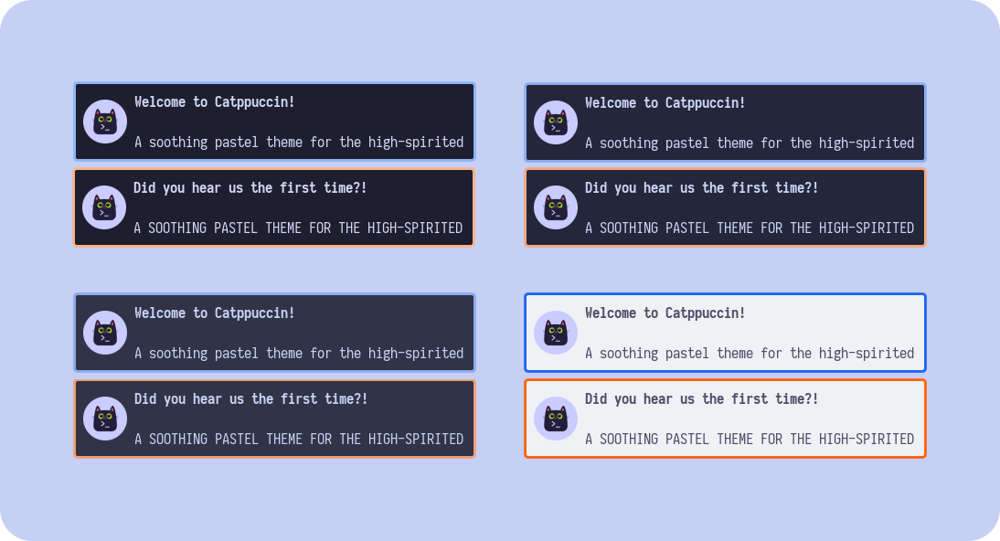

<h3 align="center">
	 
	
	Catppuccin for <a href="https://github.com/emersion/mako">mako</a>
	
</h3>

    
    
    

	

## Usage

1.

    $ cd ~/

    $ git clone https://github.com/tuxslack/mako.git

    $ cd mako/

    $ mkdir -p $HOME/.config/mako/

    $ mv -i config $HOME/.config

    Root: mv -i usr /
  
    $ alternador-de-tema-mako.sh

## 💝 Thanks to

- [Lokesh Krishna](https://github.com/lokesh-krishna)
- [Isabelinc](https://github.com/Isabelincorp)
- [catppuccin](https://github.com/catppuccin)

&nbsp;

Copyright &copy; 2025-present <a href="https://github.com/tuxslack" target="_blank">tuxslack</a>

